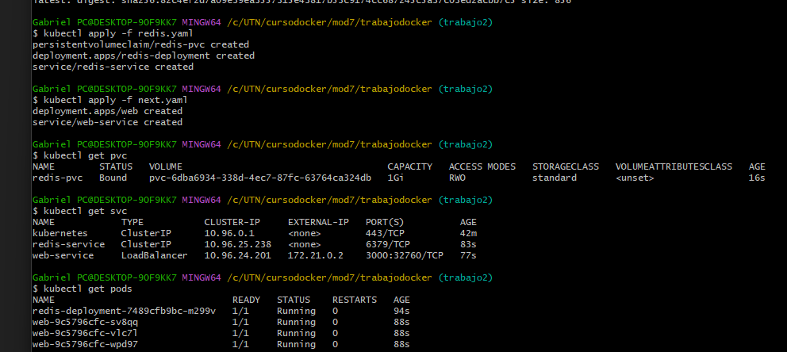

# Trabajo practico integrador 2 - Luis Gabriel Garcia

## Enunciado

Tomando como punto de partida lo entregado en el trabajo práctico número 1, entregar un archivo de texto (Word, MD o similar) donde se explique cómo armaría la infraestructura en Kubernetes, y por qué, para correr la aplicación. Indicar si haría algún cambio en su arquitectura o tecnologías para lograr un buen escalamiento.

Incluir, además, ejemplos de yaml donde se tenga en consideración el cómputo (pods/deployments/replicaset), persistencia (en caso de ser necesario) y red (servicios).

Al menos el YAML de cómputo y persistencia debe correr en Kubernetes para Docker Dektop o GKE (indicar en cuál).

## Desarrollo

### 1. Subir imagen a Docker registry
Para poder utilizar mi imagen tengo que subirla a docker registry
```
docker-compose up --build
```
imagen creada: `trabajodocker-web`

```
docker tag trabajodocker-web:latest gabogarcia/trabajodocker-web:latest
```

```
docker push gabogarcia/trabajodocker-web:latest
```

[Docker hub image](https://hub.docker.com/r/gabogarcia/trabajodocker-web)

## 2. Redis
### - Persistencia redis

El primer paso es crear la persistencia para redis. Utilizando un Persistent volume claim llamado redis-pvc
Creando un Deployment y un servicio para redis en el mismo manifiesto `redis.yaml`

Nota: tambien puedo usar un statefulSet para poder escalar el PVC en mas replicas, pero no es necesario en este caso

### - Deployment redis
- El deployment se llama `redis-deployment`
- Busca la imagen `redislabs/redismod` y la levanta en el puerto 6379. 
- Monta el PVC en `/data`

### - Service redis
Un simple servicio `Cluster IP` para que sea solamente accesible dentro de mi cluster
Con nombre `redis-service` para poder utilizar redis a travez del puerto `redis-service:6379`
 
## Next Web app

No necesita persistencia porque consume el servicio de redis

### - Deployment 
Un deployment con 3 replicas , es decir con 3 pods dentro del nodo, cada pod contiene un container de la imagen `gabogarcia/trabajodocker-web:latest` que esta en docker registry

Se expone en el puerto 3000. 
Utiliza el `redis-service` del puerto 6379

### - Service 

Busca los pods que tenga el label `web` en selector
Es un servicio del tipo load balancer que crea una IP Publica para poder acceder desde fuera del cluster

primero tengo que correr:

`
kubectl apply -f redis.yaml
`

Para poder crear el servicio de redis y poder conectarlo con mi aplicacion web en next js 

`
kubectl apply -f next.yaml
`
Aca podemos observar: 
- 3 pods creados para web y 1 pod para redis
- 2 servicios: `redis-service` (ClusterIP) y `web-service` (LoadBalancer). 
- En Docker Desktop, el LoadBalancer asigna un NodePort, por lo que la aplicación se puede acceder en el host mediante `http://localhost:32760`. 
- En un cluster en la nube, `web-service` recibiría una IP pública accesible desde Internet.




Abro en http://localhost:3000

## redis.yaml

```
apiVersion: v1
kind: PersistentVolumeClaim
metadata:
  name: redis-pvc
spec:
  accessModes:
    - ReadWriteOnce
  resources:
    requests:
      storage: 1Gi
---
apiVersion: apps/v1
kind: Deployment
metadata:
  name: redis-deployment
spec:
  replicas: 1
  selector:
    matchLabels:
      app: redis-app
  template:
    metadata:
      labels:
        app: redis-app
    spec:
      containers:
        - name: redis
          image: redislabs/redismod
          ports:
            - containerPort: 6379
          volumeMounts:
            - mountPath: /data
              name: redis-storage
      volumes:
        - name: redis-storage
          persistentVolumeClaim:
            claimName: redis-pvc
---
apiVersion: v1
kind: Service
metadata:
  name: redis-service
spec:
  selector:
    app: redis-app
  ports:
    - port: 6379
      targetPort: 6379
```


### next.yaml
```
apiVersion: apps/v1
kind: Deployment
metadata:
  name: web
spec:
  replicas: 3 
  selector:
    matchLabels:
      app: web
  template:
    metadata:
      labels:
        app: web
    spec:
      containers:
        - name: web
          image: gabogarcia/trabajodocker-web:latest
          ports:
            - containerPort: 3000
          env:
            - name: REDIS_HOST
              value: "redis-service"
            - name: REDIS_PORT
              value: "6379"
---
apiVersion: v1
kind: Service
metadata:
  name: web-service
spec:
  selector:
    app: web
  ports:
    - port: 3000
      targetPort: 3000
  type: LoadBalancer


```